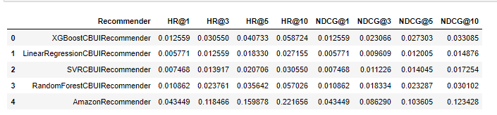
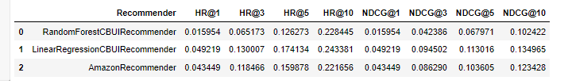

# Content-based recommender


Author: Konrad Jasiński

## Requirements

Python 3.7.9 or higher

Install all necessary packages provided in requirements.txt

With pip:
```
pip install -r requirements.txt
```
With conda:
```
conda install --file requirements.txt
```

## Overview

The goals of the project are:

1. pre-process data of hotel recommendations for content based recommender,
2. select best user and item features,
3. tune the model,
4. compare the results against Amazon recommender.

Data preparation is done in <code>project_1_data_preparation.ipynb</code>


Defining features, implementing recommender, tunning, and testing the recommender are included in <code>project_1_recommender_and_evaluation_approach1.ipynb</code>

and

<code>project_1_recommender_and_evaluation_approach2.ipynb</code>

The difference between approaches is generation of negative interactions in fit function.

### Used algorithms

Approach 1
- XGBoost
- Linear Regression
- SVR
- Random Forest

Approach 2
- Linear Regression
- Random Forest


### Achieved results
Approach 1



Approach 2



